# World Shooting League

An online league for sport shooters on electronic targets. Two shooters compete
independently of time and place: each shoots at their own club, reports the
score with a photo of the display, and neither result becomes visible until both
have submitted. Afterwards each checks the other's photo.

This repository contains:

* **`supabase/`** — the data model: Postgres schema with the state machine, row
  level security and Glicko-2 rating.
* **`mobile/`** — the Expo client for iOS, Android and web.

## Formats

Short formats, deliberately:

| Format | How it runs |
|---|---|
| `single_10` | One series of 10 shots, one week to shoot it. |
| `best_of_five` | Five series of 10 shots, first to 3 points wins. All five bouts are open at once. |

Disciplines in the seed: `AR10ET` (air rifle 10 m standing), `AP10ET` (air
pistol 10 m), `SBR10ET` (smallbore 50 m prone), `SBP10ET` (sport pistol 25 m).

## Screens

These are captures of the running build, not drawings of it.
`mobile/scripts/capture-screenshots.mjs` exports the web build, answers every
Supabase request from a fixture file and photographs the screens in a
phone-sized browser. Only the league behind them is invented — the layout, the
type and the wording are whatever the components currently render, so a
regression shows up in the pictures.

```bash
cd mobile && npm run screenshots     # needs playwright, see mobile/README.md
```

**Without an account.** Seasons, tables and finished matches are readable by
anyone; a match still being shot is not.

<p>
  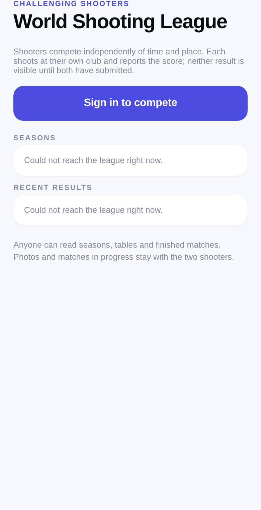
  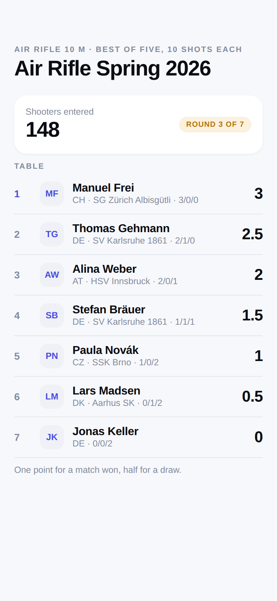
  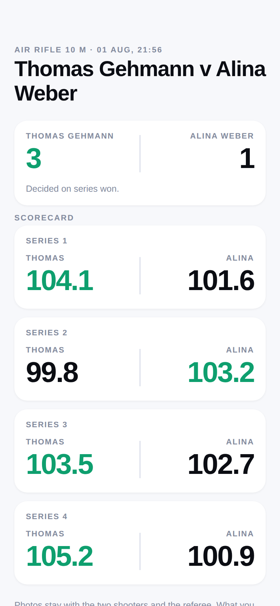
  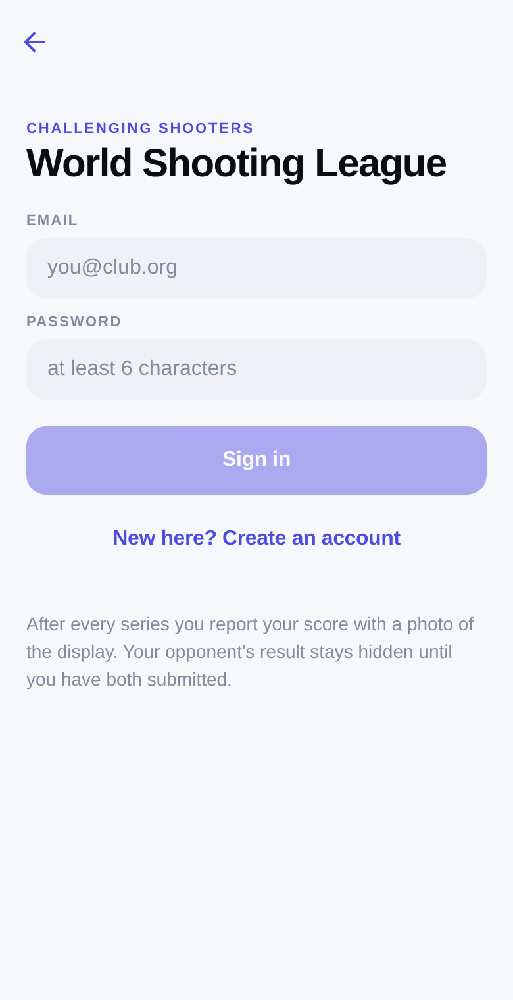
</p>

**Competing.** Your matches, one of them running: series 1 decided, series 2
reported by you and still hidden, series 4 waiting to be shot.

<p>
  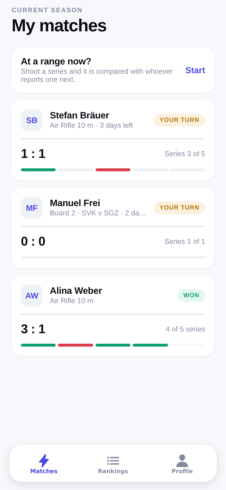
  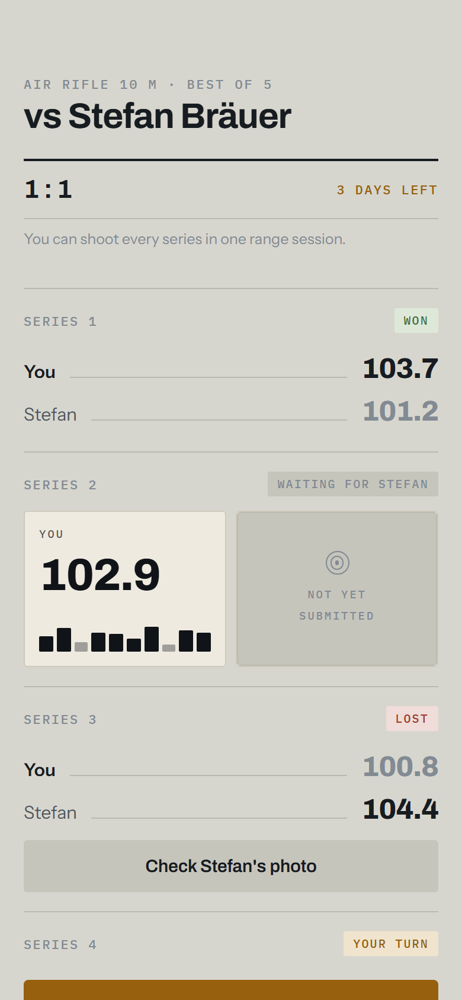
  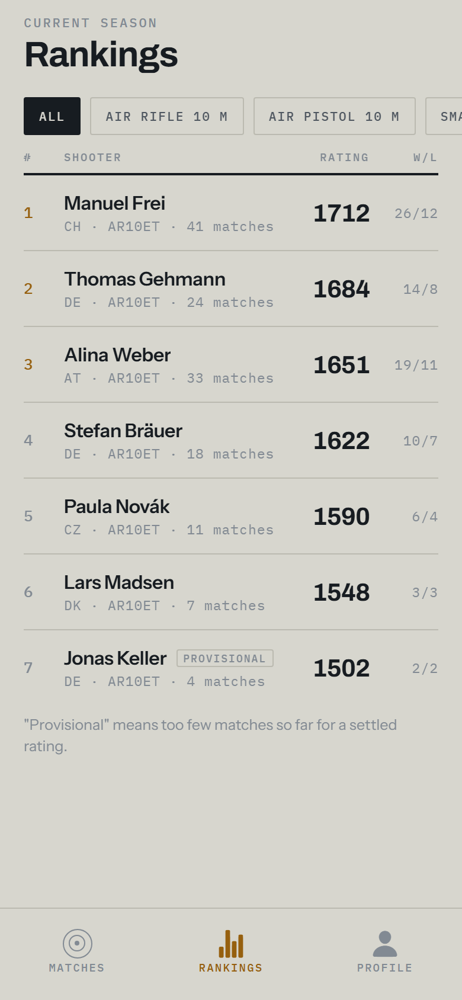
  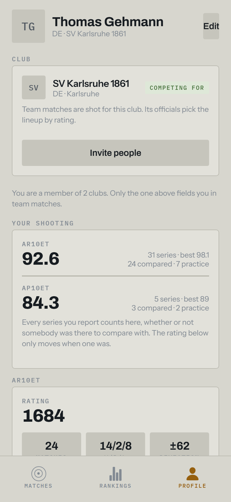
</p>

**Reporting and checking.** One number, the inner tens where the discipline is
scored in whole rings, and a photo of the display. Afterwards the opponent
compares the two.

<p>
  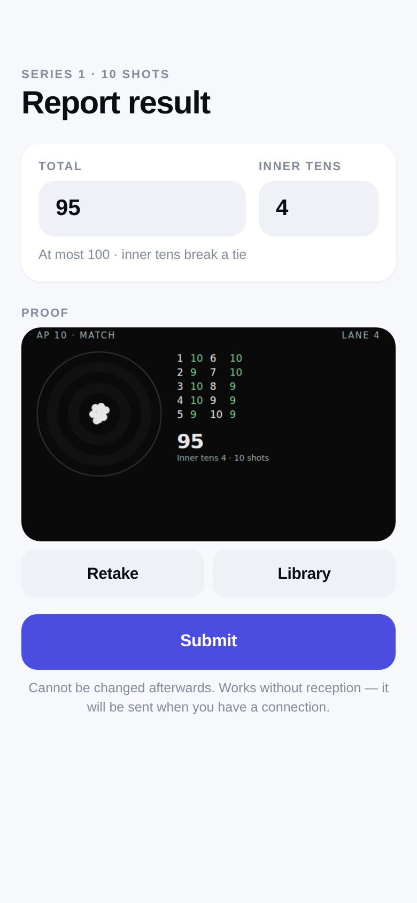
  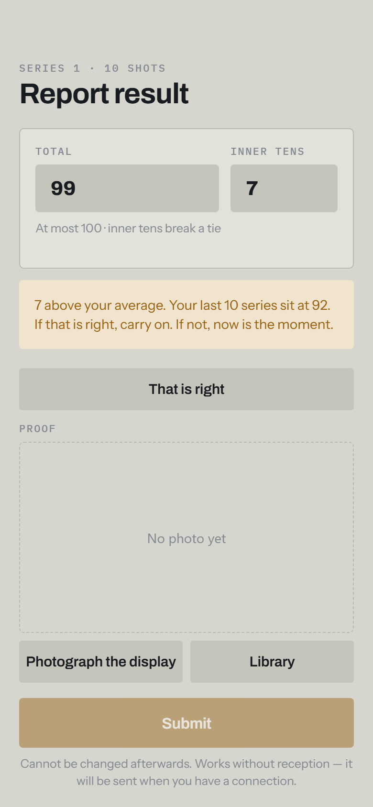
  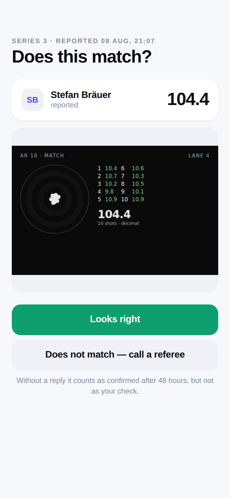
</p>

**Getting in.** Signing up records an age and a consent you have to reach for.
A shooter enters a season themselves; a club is entered by one of its officials,
and the entry says whether the club can actually field a team. Both pages carry
the link a captain pastes into a chat group.

<p>
  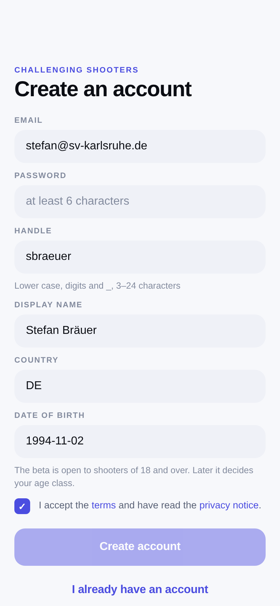
  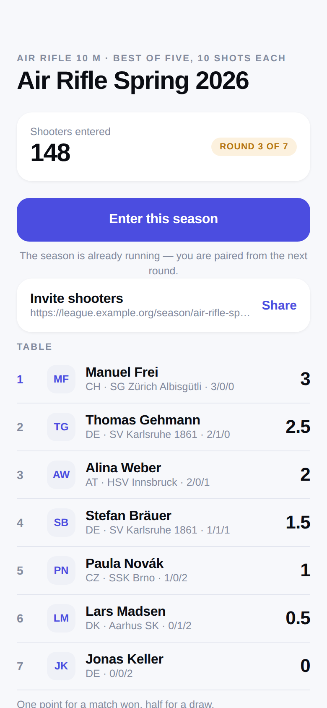
  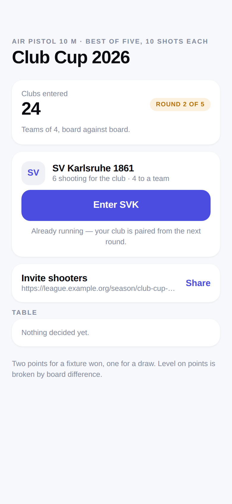
  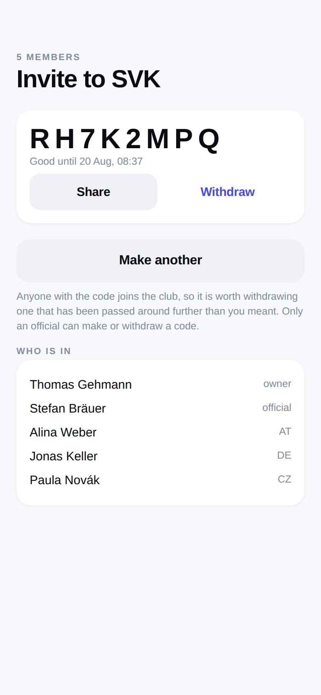
</p>

**Settling a disagreement.** When two shooters cannot agree, a referee gets both
photos and four ways to end it.

<p>
  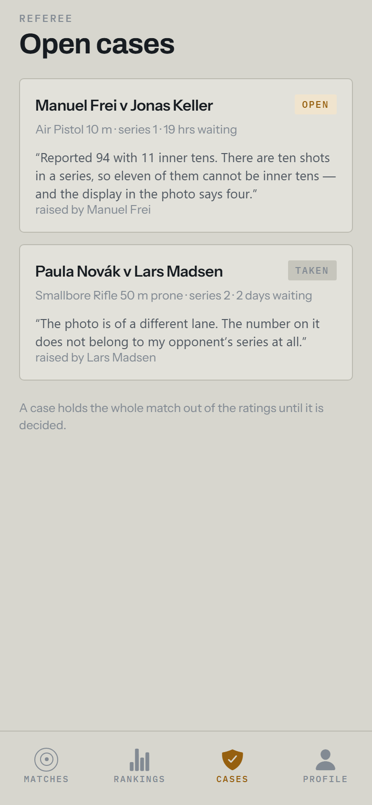
  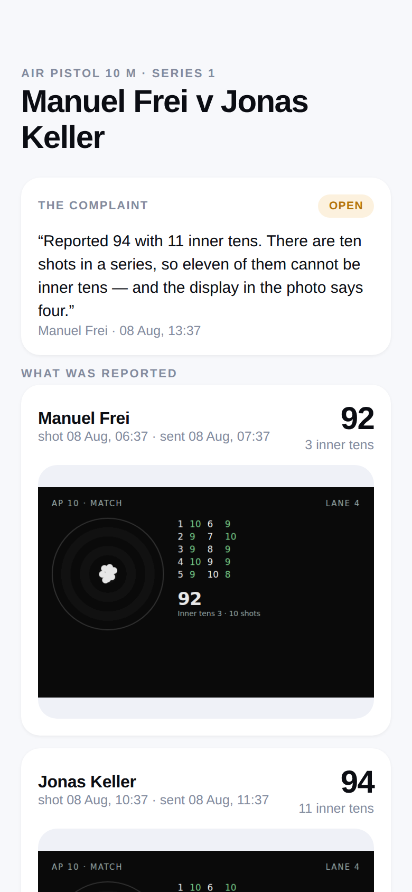
  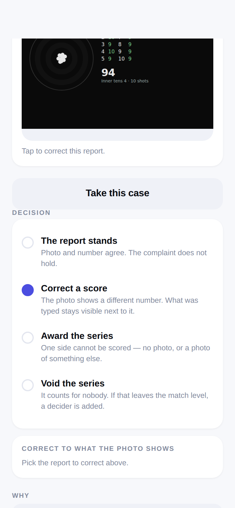
</p>

**Without reception, and in the dark.** A report shot in a basement range waits
on the phone and sends itself. The right-hand pair is the same app on a phone
set to dark — the two palettes are built separately, not inverted.

<p>
  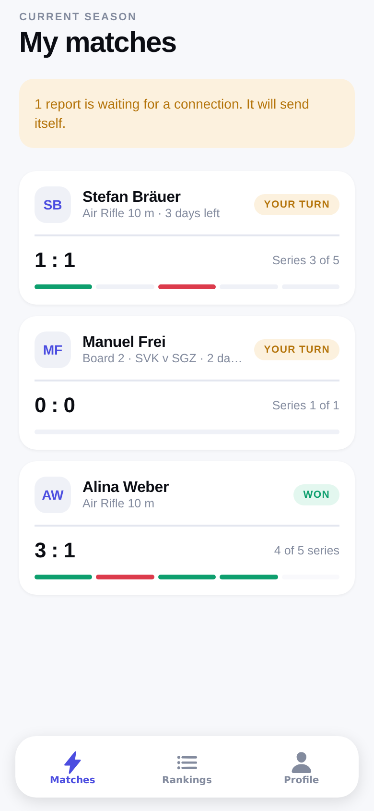
  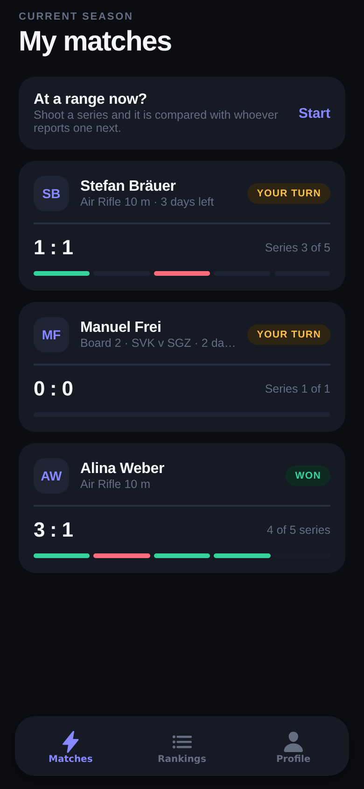
  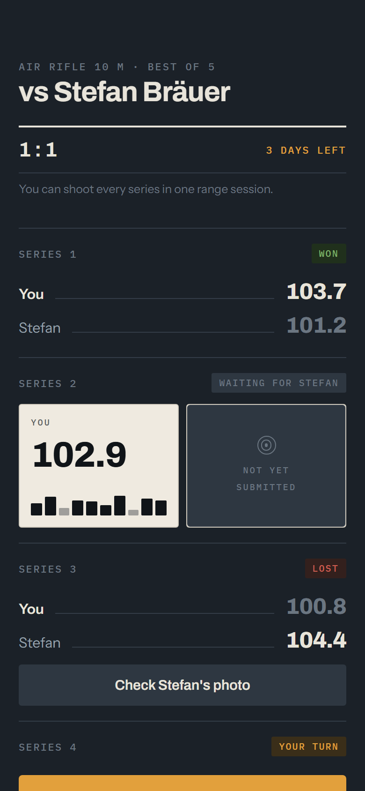
</p>

Every screen is also annotated, one design decision at a time, in
[`docs/mockups.html`](docs/mockups.html) — open it in a browser.

## Who can see what

Results nobody can link to might as well not exist, so the league reads without
an account:

| Open to anyone | Behind a sign-in |
|---|---|
| Seasons and their tables | Reporting a result |
| Club pages and rosters | Checking an opponent's photo |
| Finished matches, series by series | Any match still in progress |
| Rankings | Target photos, disputes, notifications |

That split is enforced in the database, not the client. Spectators read views
that run with the owner's rights and expose settled results only
(`match_scorecard`, `season_summary`, `season_standings`, `club_profile`); the
tables underneath are not granted to `anon` at all. A match in progress is
exactly what the blind reveal protects, so it appears on no public surface.

## Layout

```
supabase/
  migrations/        schema, in the order it is applied
  seed.sql           disciplines and formats
  tests/             SQL tests against a throwaway cluster
mobile/              Expo client (see mobile/README.md)
  scripts/
    fixtures.mjs             a sample league, in the shapes the app reads
    capture-screenshots.mjs  regenerates docs/screenshots/
scripts/
  test-local.sh      apply migrations and run the tests
  verify-deploy.sql  check a live project after db push
  ops.sql            what an operator does: seasons, rounds, roles, deletions
docs/
  beta-checklist.md  what has to happen before real people sign up
  data-model.md      entities, state machine, design decisions
  mockups.html       every screen, annotated
  screenshots/       captures from the running build
```

Migrations:

| File | Contents |
|---|---|
| `..._init_types.sql` | enums and shared helpers |
| `..._profiles.sql` | shooter profiles, signup trigger |
| `..._catalog.sql` | disciplines and formats |
| `..._seasons.sql` | seasons, entries, rounds |
| `..._matches.sql` | matches and bouts |
| `..._submissions.sql` | reports, validation, blind reveal |
| `..._disputes.sql` | referee cases |
| `..._ratings.sql` | Glicko-2 |
| `..._settlement.sql` | scoring, deadlines, finalization |
| `..._rls.sql` | row level security and public views |
| `..._storage.sql` | buckets for target photos and avatars |
| `..._pairing.sql` | round pairing |
| `..._scheduling.sql` | `run_league_tick()` and the cron job |
| `..._clubs.sql` | clubs, membership, invites |
| `..._team_competition.sql` | club-vs-club fixtures and the league table |
| `..._notifications.sql` | the outbox, its triggers and the deadline sweep |
| `..._public_views.sql` | what a signed-out visitor may read |
| `..._referee.sql` | the case queue and the four ways to end one |
| `..._joining.sql` | a shooter entering and leaving a season from the app |
| `..._accounts.sql` | age gate, recorded consent, export and deletion |
| `..._beta_metrics.sql` | the numbers the beta is judged on |
| `..._club_entry.sql` | a club official entering the club in a team season |
| `..._club_invites.sql` | minting, listing and withdrawing an invite code |
| `..._email_notifications.sql` | the second delivery channel and its queue |

Edge functions:

| Function | Purpose |
|---|---|
| `send-notifications` | drains the notification outbox to push **and** email |
| `public-pages` | server-rendered HTML for seasons, matches and clubs |

## Testing locally

Two suites, neither needing Docker, a device or a network.

```bash
./scripts/test-local.sh   # the schema, against a throwaway postgres-16 cluster
./scripts/test-node.sh    # logic that runs off-database
```

`test-node.sh` covers the three pieces that are pure enough to check directly:
the public page renderer (escaping, meta tags, content actually being in the
HTML), the notification email builder (escaping, links, and that no message
carries a score — the blind reveal would otherwise have a hole an email could
walk through), and the outbox's error classification, the decision that
separates "wait for reception" from "the server said no".

The script builds a throwaway cluster, applies stub, migrations and seed, and
runs the tests in `supabase/tests/`. The stub stands in for what Supabase
normally provides: `auth.users`, `auth.uid()`, the `storage` schema and the
`anon` / `authenticated` roles.

What is covered:

* **`10_match_lifecycle.sql`** — pairing, blind reveal, a best-of-five ending
  after three won bouts, the dispute window blocking rating, Glicko-2 applying
  afterwards, `finalize_match()` being idempotent, a file export cross-checking
  its own total, and a tied pistol match decided on inner tens.
* **`20_blind_reveal_rls.sql`** — the opponent sees **nothing** before
  submitting; double submission, submitting on someone else's behalf,
  overwriting and deleting all fail; an outsider sees the result but no
  submission.
* **`30_deadlines_and_validation.sql`** — walkover on a missed deadline,
  shoot-off bout on a dead-level match, automatic confirmation after a lapsed
  window (and its effect on the rate), voiding dead matches; rejection of
  impossible totals, missing inner tens where the discipline requires them,
  more inner tens than shots, tenths in a full-ring discipline, a shot array
  that disagrees with the total, backdated series and missing photos.
* **`50_referee.sql`** — a shooter cannot decide their own case; a report
  upheld, a score corrected so that it flips who won the match, a series
  awarded, a series voided leaving a decider to be shot; the reported number
  staying readable beside the correction; a case that cannot be decided twice
  and a decision that needs a reason.
* **`70_joining.sql`** — joining a season that is already running, joining
  twice being the same entry, leaving and coming back, a national ladder
  refusing the wrong country, a team season refusing an individual and vice
  versa, and a club that only an official may enter.
* **`60_accounts.sql`** — an adult gets in and a minor does not, consent is
  recorded, the export carries what it should, and deletion removes the name
  while the results survive; the beta's own metrics, admin-only.
* **`40_clubs_and_teams.sql`** — founding a club and joining by invite code, a
  lineup that excludes a member who competes for someone else, a team round
  paired board by board, aggregation into a 2:1 fixture win, the league table,
  the notifications each step produces, the deadline sweep deduplicating on a
  second run, and opting out stopping the queue at the source.

## Going into beta

The loop is complete: get paired, shoot, report, reveal, check, get rated — and
now also enter a season from the app, and have a referee end a disagreement.
[`docs/beta-checklist.md`](docs/beta-checklist.md) is the ordered list of what
still has to happen once, from pushing the schema to writing the invitation,
including how the beta should be shaped so that the ladder is not empty.

The beta ships as a **web app**, not through the stores. Not because sport
shooting apps are banned — they are not; the store rules prohibit *facilitating
the purchase* of firearms and ammunition, and ISSF scoring apps sit in both
stores today — but because store review, two developer accounts and signed
builds cost a fortnight that buys nothing in week one.

```bash
cd mobile && npm run build:web    # dist/, ready for any static host
```

That build carries a service worker, which is what makes a **cold start without
a network** work. The outbox keeps a report safe and the query cache keeps open
matches readable, but neither helps if the app will not open — and a range is a
concrete box in a basement, so opening it there is the normal case. Verified by
serving the build, letting the worker install, taking the server away
completely, and loading the page again: it renders.

What a native build would still buy is push on iOS, where a web app can only be
pushed to once somebody has added it to their home screen. That is why
notifications also go out by **email**, which reaches everybody and needs
nothing installed.

Four things are worth knowing before the invitations go out:

* **The age gate is real.** The signup trigger refuses anyone under 18, because
  guardian consent and the protections a junior account needs are not built. A
  large share of ISSF shooters are juniors, so this is a deliberate hole in the
  market, not an oversight.
* **The documents are drafts.** `mobile/lib/legal.ts` has an imprint, a privacy
  notice and terms with `<angle brackets>` where the operator's details go. They
  need reading by someone qualified.
* **Deletion works from the app** and leaves results behind on purpose: a match
  is the opponent's record too. What goes immediately is the name, the handle,
  the date of birth and the profile.
* **`beta_health()` and `beta_backlog()` are the point of the beta.** Six
  numbers with a decision attached to each, and four things that should never
  be growing.

## Applying to a Supabase project

1. **Enable `pg_cron`** — Dashboard → Database → Extensions. Without it the
   scheduling migration fails.
2. **Push schema and catalog:**
   ```bash
   npx supabase link --project-ref <ref>
   npx supabase db push
   psql "$DATABASE_URL" -f supabase/seed.sql
   ```
3. **Verify everything landed:**
   ```bash
   psql "$DATABASE_URL" -f scripts/verify-deploy.sql
   ```
   Every line must end in OK. It checks the tables, RLS on each of them, the
   three select policies behind the blind reveal, `submissions` being
   insert-only, the functions, views and triggers, the storage buckets and their
   policies, the seed, the cron job, and the Glicko-2 maths against reference
   values.
4. **Wire up the client** — `mobile/.env` takes the project URL and the
   publishable key (formerly "anon key") from *Project Settings → API Keys*.
   That key is public by design and belongs in the client; the secret /
   `service_role` key bypasses RLS and must never ship in an app.

For testing it helps to turn off the confirmation email under *Authentication →
Sign In / Providers → Email*, otherwise a new account cannot sign in right away.

## Reporting without reception

A range is usually a concrete box in a basement, so the moment a shooter is most
likely to submit is the moment they are least likely to have a connection.

Every report goes through a local queue, online or not. Submitting writes an
entry and then tries to send it: online the entry disappears within a second,
offline it waits and the app says so. Two details make the delay safe rather
than merely tolerable:

* **The photo is copied out of the picker's cache** into the app's own storage,
  so it survives the system reclaiming space, a restart or a reboot.
* **`shot_at` is when the series was fired**, not when it reached the server.
  Without that a queued report would claim to have been shot hours later, and
  the database's window check would be measuring the wrong thing.

A failure that will pass on its own — no connection, a timeout — leaves the entry
queued. Anything the database refuses is permanent, so it is marked instead and
shown with the reason and a retry. A duplicate counts as delivered: it means an
earlier attempt got through after all.

Reading works offline too. The query cache is persisted, so a shooter who opened
the app at home still sees their open matches in the basement.

## Reporting model

Two numbers at most, and a photo. Deliberately **no OCR**: typing one number is
not worth automating, and the verification is done by the opponent after the
reveal — motivated, and more reliable than a model reading a photo of a monitor.
Ranges that can export their data (SIUS CSV, later a manufacturer API) may also
supply the individual shots, in which case the two paths cross-check.

The second number, inner tens, is asked for only where the discipline is scored
in whole rings. That is the ISSF tiebreak for full-ring scores, and simulation
puts the tie rate for a 10-shot pistol series around 11% against roughly 2% for
decimal rifle — so pistol needs it and rifle does not.

Reasoning in [`docs/data-model.md`](docs/data-model.md).

## Running the app

```bash
cd mobile
cp .env.example .env      # project URL and publishable key
npm install
npm start
```

Details in [`mobile/README.md`](mobile/README.md).

## Next steps

What exists today is one complete loop: get paired, shoot, report, reveal,
check, get rated. That is enough to run a closed pilot and not enough to run a
league. What follows is ordered by what actually decides whether a league lives,
drawn from how the established platforms solve the same problems.

Three things decide it. Everything else is downstream.

### 1. Liquidity — nobody plays an empty ladder

A challenge needs an opponent in the same discipline at a similar level. Spread
a few hundred shooters over four disciplines and every ladder looks abandoned.
[FACEIT](https://support.faceit.com/hc/en-us/articles/14996562458268-FACEIT-Beginners-Guide)
solves this two ways: hubs, where a known community plays among itself, and
ladders grouped by level range so each one stays relevant. Both apply here.

- [x] **Clubs as a first-class entity.** Done: clubs, membership, invite codes,
      and the club a shooter competes for.
- [x] **Club vs club team matches.** Done: a fixture is a container of ordinary
      matches, one per board, with a league table on top.
- [ ] **Join a season from inside the app**, with an invite link a club official
      can send round. Today entrants are inserted into `season_entries` by hand.
- [ ] **A free challenge queue** so somebody who joins mid-season has something
      to do before the next round pairs. The schema already allows a match with
      no round.

### 2. The loop — turn-based play needs a reason to come back

- [x] **Push notifications.** Done: an outbox written by triggers, drained by
      `supabase/functions/send-notifications`. Deep links carry the reader
      straight to the match.
- [ ] **Divisions with promotion and relegation.** One table for everyone is
      demotivating for everyone outside the top ten. FACEIT splits its ladders by
      level range for exactly this reason; ESEA and ESL run divisions. Glicko-2
      already provides the number to split on.
- [ ] **A weekly challenge.** A single shared task — "10 shots kneeling this
      week" — gives a reason to open the app without needing an opponent to
      respond. FACEIT calls these missions.
- [ ] **Streaks, personal bests and awards.** Cheap to build, and the 2016
      mockups already had "NEW PERSONAL BEST" and a medal.
- [ ] **The activity feed** from the original design: results, awards, comments.
      Worth building once the competitive loop is busy, not before.

### 3. Trust at scale — the ranking is the product

Peer confirmation works while everyone knows each other. It does not survive
growth, and it is exactly where the online chess platforms invested.
[Chess.com](https://www.chess.com/cheating) scores over a hundred factors and
auto-flags performances that are statistically improbable; Lichess pairs
statistics with human moderators and quietly separates offenders rather than
announcing bans.

- [ ] **Statistical fair-play flagging.** The equivalent signal here is a
      shooter's own distribution over time. A submission far outside their
      history, or a sudden step change in level, should open a case by itself
      instead of waiting for an opponent to notice. `rating_events` and the
      submission history already hold the data.
- [ ] **A referee console.** A case queue, both photos side by side, a decision
      with a reason. Disputes can be raised today but not worked.
- [ ] **A sanction ladder and an appeal path.** Warning, voided result, rating
      rollback, suspension — with the reason recorded and the shooter able to
      respond.
- [ ] **Heavier verification where the stakes are.** A witness signature or a
      short video for promotion into the top division and for qualifying to a
      final. The rule the subscription leagues follow: verification scales with
      what is at stake, not uniformly.
- [ ] **Sandbagging detection.** Deliberately shooting low to farm an easier
      division becomes worth doing the moment divisions exist. Chess.com detects
      it explicitly; so should this.

### Competition structure

- [ ] Cups and knockout brackets alongside the ladder — a season is a long
      commitment, a weekend cup is not.
- [ ] **A season final on site.** The reason the whole thing exists: the online
      league qualifies, the title is decided in a hall. It also settles the trust
      question — manipulating an online ladder is embarrassing when the final is
      shot in front of people.
- [ ] Categories: junior, senior, and the equipment classes shooters expect to
      be separated by.
- [ ] An optional handicap mode so a club can run a mixed-ability internal
      ladder.

### Reach

- [x] **Public pages** for seasons, tables, clubs and finished matches. Done: a
      `(public)` route group that works signed out, backed by views that expose
      settled results only.
- [x] **Server-rendered HTML** so a crawler sees those pages. Done: the
      `public-pages` edge function serves real HTML at `/s/{slug}`, `/m/{id}`
      and `/c/{slug}`, with Open Graph tags and JSON-LD.
- [ ] Shareable match cards for social, and live results during an on-site
      final.

### Operations, and two things that block a public launch

- [ ] An admin console: create seasons, manage the catalog, work the moderation
      queue.
- [ ] **Minors.** A large share of ISSF shooters are juniors. Age gate, guardian
      consent, and restraint on photos and public profiles for under-16s. This is
      a launch blocker, not a feature.
- [ ] **Prize money is a legal question before it is a product question.** An
      entry fee plus a cash prize can fall under German gambling law; skill-based
      competition helps but is not a blanket exemption. Keep prizes attached to
      the on-site final and take advice before money moves.
- [ ] App store review: firearms content policies are real. Sport shooting apps
      exist, but affiliate links to weapons or ammunition are a rejection risk.
- [ ] GDPR: data export and deletion, and a retention rule for evidence photos.

### Integrations

- [ ] CSV import for SIUS exports (`source = 'file_export'`), which already has
      a place in the schema.
- [ ] DISAG's QR path, where a range already publishes results digitally.
- [ ] A manufacturer API once there is leverage to ask for one. Platforms like
      Challengermode report results automatically and never ask for a screenshot;
      that is the end state, and it is worth reaching only from a position where
      the manufacturers want the distribution.
