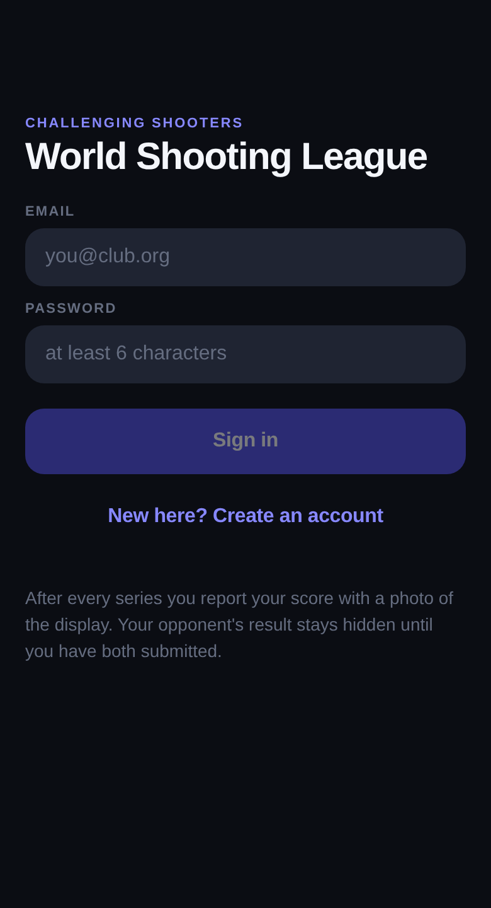

# World Shooting League

An online league for sport shooters on electronic targets. Two shooters compete
independently of time and place: each shoots at their own club, reports the
score with a photo of the display, and neither result becomes visible until both
have submitted. Afterwards each checks the other's photo.

This repository contains:

* **`supabase/`** — the data model: Postgres schema with the state machine, row
  level security and Glicko-2 rating.
* **`mobile/`** — the Expo client for iOS, Android and web.

## Formats

Short formats, deliberately:

| Format | How it runs |
|---|---|
| `single_10` | One series of 10 shots, one week to shoot it. |
| `best_of_five` | Five series of 10 shots, first to 3 points wins. All five bouts are open at once. |

Disciplines in the seed: `AR10ET` (air rifle 10 m standing), `AP10ET` (air
pistol 10 m), `SBR10ET` (smallbore 50 m prone), `SBP10ET` (sport pistol 25 m).

## Screens

The sign-in screen, captured from the running web build in both themes:

<p>
  
  
</p>

Every screen — matches, the blind reveal before and after, reporting, checking a
photo, rankings and profile — is laid out in
[`docs/mockups.html`](docs/mockups.html); open it in a browser. Colours, spacing
and type there come from `mobile/lib/theme.ts` and the wording is what the app
renders. Only the data is invented.

## Layout

```
supabase/
  migrations/        schema, in the order it is applied
  seed.sql           disciplines and formats
  tests/             SQL tests against a throwaway cluster
mobile/              Expo client (see mobile/README.md)
scripts/
  test-local.sh      apply migrations and run the tests
  verify-deploy.sql  check a live project after db push
docs/
  data-model.md      entities, state machine, design decisions
  mockups.html       every screen, annotated
  screenshots/       captures from the running build
```

Migrations:

| File | Contents |
|---|---|
| `..._init_types.sql` | enums and shared helpers |
| `..._profiles.sql` | shooter profiles, signup trigger |
| `..._catalog.sql` | disciplines and formats |
| `..._seasons.sql` | seasons, entries, rounds |
| `..._matches.sql` | matches and bouts |
| `..._submissions.sql` | reports, validation, blind reveal |
| `..._disputes.sql` | referee cases |
| `..._ratings.sql` | Glicko-2 |
| `..._settlement.sql` | scoring, deadlines, finalization |
| `..._rls.sql` | row level security and public views |
| `..._storage.sql` | buckets for target photos and avatars |
| `..._pairing.sql` | round pairing |
| `..._scheduling.sql` | `run_league_tick()` and the cron job |

## Testing locally

Needs only `postgresql-16` — no Docker, no Supabase CLI:

```bash
./scripts/test-local.sh
```

The script builds a throwaway cluster, applies stub, migrations and seed, and
runs the tests in `supabase/tests/`. The stub stands in for what Supabase
normally provides: `auth.users`, `auth.uid()`, the `storage` schema and the
`anon` / `authenticated` roles.

What is covered:

* **`10_match_lifecycle.sql`** — pairing, blind reveal, a best-of-five ending
  after three won bouts, the dispute window blocking rating, Glicko-2 applying
  afterwards, `finalize_match()` being idempotent, a file export cross-checking
  its own total, and a tied pistol match decided on inner tens.
* **`20_blind_reveal_rls.sql`** — the opponent sees **nothing** before
  submitting; double submission, submitting on someone else's behalf,
  overwriting and deleting all fail; an outsider sees the result but no
  submission.
* **`30_deadlines_and_validation.sql`** — walkover on a missed deadline,
  shoot-off bout on a dead-level match, automatic confirmation after a lapsed
  window (and its effect on the rate), voiding dead matches; rejection of
  impossible totals, missing inner tens where the discipline requires them,
  more inner tens than shots, tenths in a full-ring discipline, a shot array
  that disagrees with the total, backdated series and missing photos.

## Applying to a Supabase project

1. **Enable `pg_cron`** — Dashboard → Database → Extensions. Without it the
   scheduling migration fails.
2. **Push schema and catalog:**
   ```bash
   npx supabase link --project-ref <ref>
   npx supabase db push
   psql "$DATABASE_URL" -f supabase/seed.sql
   ```
3. **Verify everything landed:**
   ```bash
   psql "$DATABASE_URL" -f scripts/verify-deploy.sql
   ```
   Every line must end in OK. It checks the tables, RLS on each of them, the
   three select policies behind the blind reveal, `submissions` being
   insert-only, the functions, views and triggers, the storage buckets and their
   policies, the seed, the cron job, and the Glicko-2 maths against reference
   values.
4. **Wire up the client** — `mobile/.env` takes the project URL and the
   publishable key (formerly "anon key") from *Project Settings → API Keys*.
   That key is public by design and belongs in the client; the secret /
   `service_role` key bypasses RLS and must never ship in an app.

For testing it helps to turn off the confirmation email under *Authentication →
Sign In / Providers → Email*, otherwise a new account cannot sign in right away.

## Reporting model

Two numbers at most, and a photo. Deliberately **no OCR**: typing one number is
not worth automating, and the verification is done by the opponent after the
reveal — motivated, and more reliable than a model reading a photo of a monitor.
Ranges that can export their data (SIUS CSV, later a manufacturer API) may also
supply the individual shots, in which case the two paths cross-check.

The second number, inner tens, is asked for only where the discipline is scored
in whole rings. That is the ISSF tiebreak for full-ring scores, and simulation
puts the tie rate for a 10-shot pistol series around 11% against roughly 2% for
decimal rifle — so pistol needs it and rifle does not.

Reasoning in [`docs/data-model.md`](docs/data-model.md).

## Running the app

```bash
cd mobile
cp .env.example .env      # project URL and publishable key
npm install
npm start
```

Details in [`mobile/README.md`](mobile/README.md).

## Next steps

1. Push notifications: a table for device tokens, a trigger on reveal and
   before deadlines. In turn-based play this is the retention engine.
2. Joining a season from the app instead of inserting into `season_entries`
   by hand.
3. A referee view for the case queue.
4. CSV import for SIUS exports (`source = 'file_export'`).
