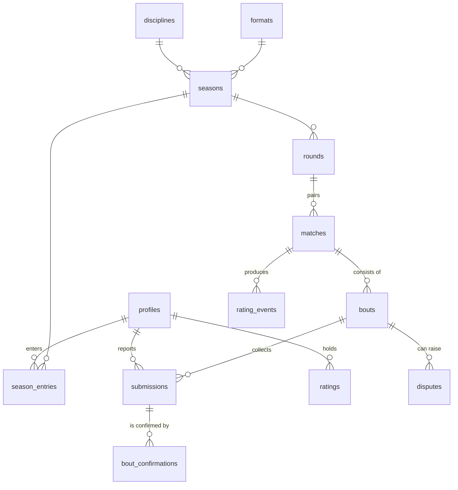
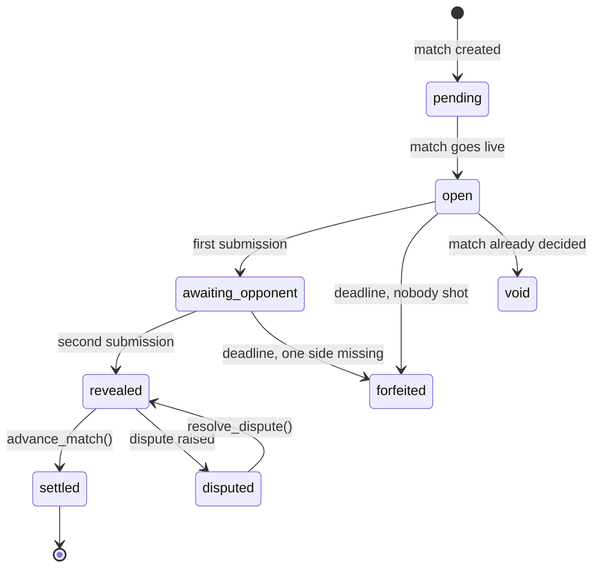
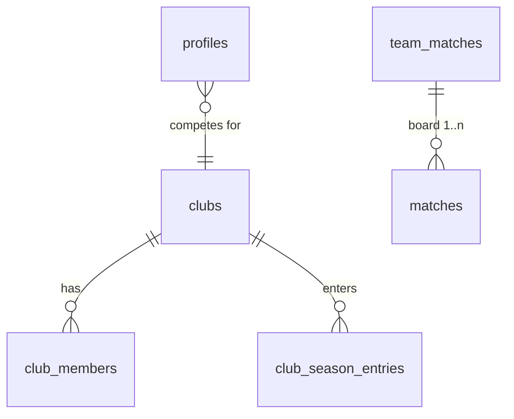

# Data model

The Postgres schema behind the World Shooting League on Supabase. Short formats:
**10 shots** as the unit, **best of five** as the league format.

## Terms

| Term | Meaning |
|---|---|
| **Bout** | One series of 10 shots. The smallest scorable unit. |
| **Match** | A duel between two shooters. `single_10` has one bout, `best_of_five` up to five. |
| **Round** | One round of the season ladder. Produces a match for every entrant. |
| **Season** | A ladder over one discipline and one format, with a fixed number of rounds. |
| **Submission** | What a shooter reports for a bout: total, photo, time of shooting, and inner tens where the discipline needs them. |
| **Club** | The organisation a shooter competes for. The unit that onboards twenty people at once. |
| **Team match** | A club-vs-club fixture. Its boards are ordinary matches. |

## Entities



`matches.round_id` and `season_id` are nullable: a match without a round is a
free-form challenge. It is rated but does not count towards a season table.

## State machine

The whole flow hangs off two columns: `bouts.state` and `matches.state`.



The **blind reveal** is the transition `awaiting_opponent → revealed`. Only
there may the opponent read the other submission — enforced by RLS, not by the
client. While a bout sits in `awaiting_opponent` the second shooter can see
*that* the other has submitted, but not *what*.

Match:

```
scheduled -> live -> settled -> finalized
                  \-> awaiting_review (dispute open)
                  \-> void (nobody shot)
```

`settled` means the winner is known and the dispute window is running.
`finalized` means the window has closed, no case is open, and **Glicko-2 has
been applied**. Ratings never move on a result that is still contested.

## Best of five: parallel, not sequential

`formats.progression = 'parallel'` opens all five bouts at once. A shooter fires
the whole match in one range session and reports five series.

Sequential would be truer to the format but would mean five waiting cycles per
match — with play independent of time and place, the reliable way to a dead
league. The column exists and `'sequential'` is implemented; the default is
deliberately `'parallel'`.

`advance_match()` always settles bouts **in index order**, so a parallel match
decides the same way regardless of which upload arrived first. Once a side
reaches `points_to_win` (3.0) the remaining bouts are set to `void`.

A match level on points is resolved in this order: aggregate score → inner tens
→ an extra shoot-off bout over 48 hours.

## Reporting: a total, a photo, and sometimes inner tens

The shooter reads the total off the range display or the printout and types it
in. The photo is mandatory — it is the evidence the opponent checks after the
reveal.

There is deliberately **no OCR**. Typing one number is not worth automating, and
the opponent verifies it anyway: motivated, and more reliable than a model
reading a photo of a monitor. Ranges that can export (SIUS CSV, later a
manufacturer API) may additionally supply the individual shots
(`source = 'file_export'`), whose sum then cross-checks the total.

### Why inner tens, and only sometimes

`disciplines.requires_inner_tens` asks for a second number where the discipline
is scored in whole rings, and for nothing extra where it is scored in tenths.

ISSF breaks a tied full-ring score on inner tens, so full-ring disciplines need
the count. Decimal scores mostly break their own ties: simulating 200,000
pairings of club-level shooters puts the tie rate for a 10-shot pistol series
around **11%** against roughly **2%** for decimal rifle. At 11%, a best-of-five
without a tiebreak would send a third of all matches into an extra round — the
exact delay that kills an asynchronous league. At 2% it is not worth a second
field at the moment of submission.

An inner ten is a position on the target, not a ring value, which has two
consequences worth knowing:

* It **cannot be derived from a shot array.** A file export supplying decimal
  values cross-checks the total but says nothing about inner tens.
* It gives only a **floor**, not a window. Every inner ten is worth at least 10,
  so `total >= inner_tens * 10`. There is no useful ceiling, because a shot that
  is not an inner ten can still score a full ten.

So the arithmetic cross-check is weak, and it is not the reason the field
exists. Typos are caught by `shooter_recent_form()` in the client, which warns
when a report sits more than 5 rings above the shooter's own average.

## What carries the trust model

1. **The blind reveal is the strongest lever.** Someone who does not know what
   they have to beat cannot keep shooting until it is enough.
2. **Submissions are immutable.** There is no update and no delete policy for
   shooters. A correction goes through a referee via `adjusted_total`, which
   leaves the original in place.
3. **Peer confirmation replaces automated scoring.** Each shooter checks the
   opponent's photo against the reported figures. Letting the window lapse does
   not block the ladder — the confirmation is set automatically and counts
   against the shooter's rate in `shooter_reliability`.
4. **`shot_at` must fall inside the bout window** (one hour of slack for clock
   drift on range printers). The cheapest replay check against reporting an old
   series.
5. **Plausibility per discipline.** Total within reach, inner tens not more than
   the shot count, whole rings only where the discipline scores that way.
6. **Photos are evidence.** The storage bucket allows insert and select, no
   update, no delete — and mirrors the reveal rule exactly. `capture_method`
   records whether the photo was taken in-app or picked from the library.
7. **Ratings only after the dispute window.** `finalize_match()` refuses while
   `dispute_closes_at` is in the future or a case is open.

## Clubs, and club against club

Shooting is already organised in clubs, which makes a club the answer to the
cold start: it brings twenty people in at once instead of one at a time. It is
the equivalent of a FACEIT hub — a known group playing among itself, which works
at a size where a global ladder would look abandoned.

A shooter can be a member of several clubs but competes for one:
`profiles.primary_club_id` decides who can field them. Membership is created
only through `redeem_club_invite()`, so the code is checked before a row exists;
there is no insert policy on `club_members` for anyone else.

**A team match is a container of individual matches, one per board.** Nothing
about the blind reveal, submissions or settlement changes — board 2 is a normal
match between two shooters, rated as one. Only the aggregation on top is new:



That shape is deliberate twice over. German league shooting already pairs
position against position, so it is the format the audience knows; and reusing
the individual machinery means there is exactly one settlement path to get
right. `matches.shooter_a` always represents `club_a`, which is what lets
`advance_team_match()` aggregate without a separate lineup table.

The lineup is the club's strongest `team_size` members by rating
(`club_lineup()`), restricted to those who actually compete for it. An official
picking boards by hand is a later refinement.

A board win is one board point, a drawn board splits it. Level on boards is
broken by total rings across the whole team. `club_standings` keeps the league
table on two points for a win and one for a draw, the convention the clubs
already use.

## Notifications

In turn-based play this is the retention engine: a match where nobody is told it
is their turn simply expires.

The database decides *what* is worth telling someone and writes it to an outbox;
`supabase/functions/send-notifications` drains the outbox and talks to Expo's
push service. Nothing in SQL knows about HTTP, which is why the triggers are
testable without a network and why a delivery outage loses nothing — unsent rows
stay unsent.

Trigger points: first submission (the opponent is told they are up, and
deliberately **not** what the score was), reveal, settlement, pairing, disputes,
and a deadline sweep from `run_league_tick()`.

Two details carry more weight than they look:

* **`notifications_dedupe`.** A unique index over
  `(shooter_id, kind, coalesce(bout_id, match_id))`. Without it the deadline
  sweep, running every ten minutes, would send the same reminder 144 times a day.
* **`enqueue_notification()` returns whether it inserted**, so a sweeper reports
  real work rather than the number of times it asked.

Clients can mark a notification read. They cannot mark one sent — `sent_at`
belongs to the edge function, which runs with the service role.

## Rating: Glicko-2

One row in `ratings` per `(shooter, discipline)` with rating, RD and volatility.
Start: 1500 / 350 / 0.06, τ = 0.5.

Elo would work too, but a shooter plays maybe eight rated matches a season.
Glicko-2 tracks rating deviation and therefore knows how little it knows about a
newcomer. `leaderboard.is_provisional` marks everything above RD 110 — newcomers
do not belong unfiltered next to established shooters.

`glicko2_decay()` inflates RD again for periods sat out, so an inactive leader
does not keep a tight deviation forever.

The SQL implementation is checked against an independent reference
implementation (Illinois variant of regula falsi for the volatility, as in the
[Glickman paper](http://www.glicko.net/glicko/glicko2.pdf), step 5).

## Pairing

`pair_round()` is Swiss-style: sort the active field by rating, pair neighbours,
skip a pairing that already happened this season and take the next candidate.
With an odd field the last one gets a bye.

That keeps matches close, and close matches get finished.

## Public views

Results nobody can link to might as well not exist, so a signed-out visitor can
read seasons, tables, club pages and finished matches.

Every public surface is a view running with `security_invoker = false`, which is
what lets it expose settled scores without exposing the rows behind them. The
tables underneath are not granted to `anon` at all — reading `submissions`,
`disputes`, `notifications` or `device_tokens` as a spectator fails on
permission, not on a row filter.

| View | Shows |
|---|---|
| `match_results` | finished matches: who, what discipline, final points |
| `match_scorecard` | those matches series by series, both sides |
| `season_summary` | a season with its discipline, format and entrant counts |
| `season_standings` | the individual table of one season |
| `club_standings` | the club table of a team season |
| `club_profile` | a club, its size and its fixture record |
| `leaderboard` | the global per-discipline rating table |
| `shooter_reliability` | how reliably someone checks their opponents |

One rule runs through all of them: **settled matches only**. A match in progress
is exactly what the blind reveal exists to protect, and putting it on a public
surface would hand anyone a way around it — read the opponent's score from the
spectator page, then go and shoot to beat it.

## Maintenance

`run_league_tick()` is the single entry point for everything time-driven: open
and pair rounds, forfeit expired bouts, void dead matches, auto-accept lapsed
confirmations, finalize due matches. It runs every 10 minutes via `pg_cron` and
returns a summary as JSON.

## Not included yet

Deliberately left out of the MVP: a social feed, awards, premium tiers, divisions
with promotion and relegation, OCR and the manufacturer integration. `submissions.source` already knows
`'file_export'` and `'device_api'` as values — nothing more is needed for that
today.
