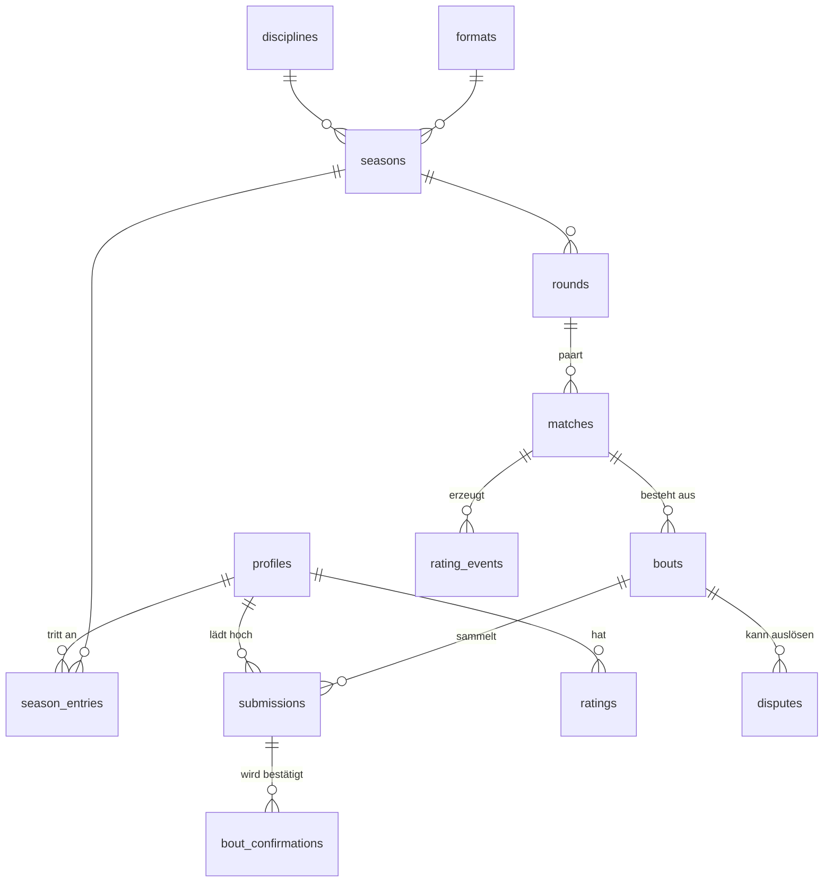
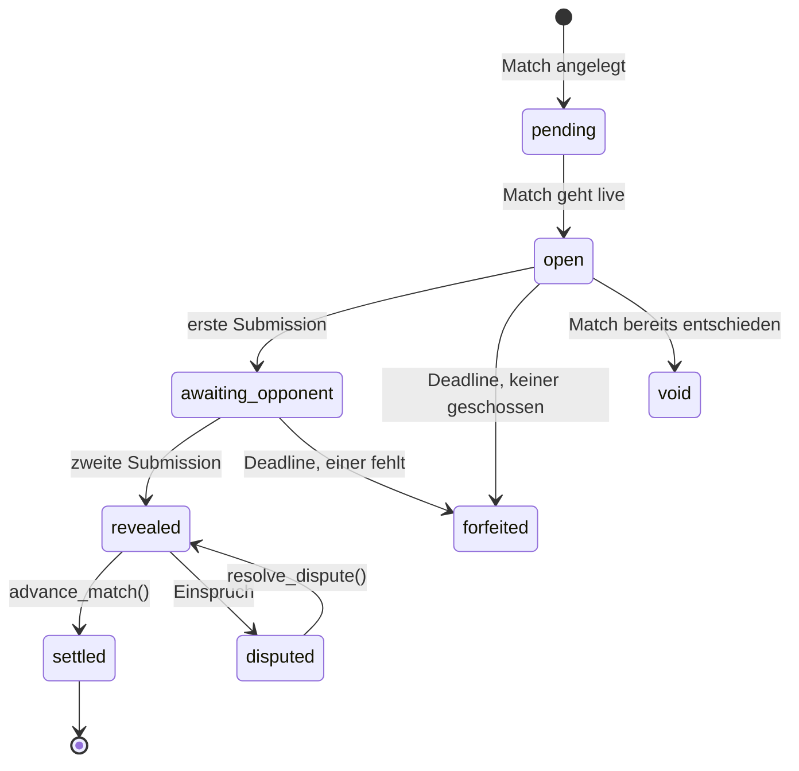

# Datenmodell

Postgres-Schema für die World Shooting League auf Supabase. Kurze Formate:
**10 Schuss** als Einheit, **Best of Five** als Ligaformat.

## Begriffe

| Begriff | Bedeutung |
|---|---|
| **Bout** | Eine Serie von 10 Schuss. Kleinste wertbare Einheit. |
| **Match** | Duell zweier Schützen. `single_10` = 1 Bout, `best_of_five` = bis zu 5 Bouts. |
| **Round** | Eine Runde der Saison-Ladder. Erzeugt für jeden Teilnehmer ein Match. |
| **Season** | Ladder über eine Disziplin und ein Format, mit fester Rundenzahl. |
| **Submission** | Was ein Schütze für einen Bout meldet: Gesamtergebnis, Anzahl Zehner, Foto, Schießzeitpunkt. |

## Entitäten



`matches.round_id` und `season_id` sind nullbar: ein Match ohne Runde ist eine
freie Challenge. Sie wird gewertet, zählt aber nicht in die Saisontabelle.

## Zustandsautomat

Der gesamte Ablauf hängt an zwei Spalten: `bouts.state` und `matches.state`.



Der **Blind Reveal** ist der Übergang `awaiting_opponent → revealed`. Erst dort
darf der Gegner die fremde Submission lesen — durchgesetzt von RLS, nicht vom
Client. Solange der Bout in `awaiting_opponent` steht, sieht der zweite Schütze
*dass* der andere abgegeben hat, aber nicht *was*.

Match:

```
scheduled -> live -> settled -> finalized
                  \-> awaiting_review (Einspruch offen)
                  \-> void (niemand hat geschossen)
```

`settled` heißt: Sieger steht fest, Einspruchsfenster läuft.
`finalized` heißt: Fenster zu, kein offener Fall, **Glicko-2 angewendet**.
Ratings bewegen sich nie auf einem Ergebnis, das noch bestritten wird.

## Best of Five: parallel statt sequenziell

`formats.progression = 'parallel'` öffnet alle fünf Bouts gleichzeitig. Ein
Schütze feuert das ganze Match in einer Standsitzung und lädt fünf Serien hoch.

Sequenziell wäre formatgetreuer, hieße aber fünf Wartezyklen pro Match — bei
zeit- und ortsunabhängigem Spiel der sichere Weg in eine tote Liga. Die Spalte
existiert, `'sequential'` ist implementiert; die Voreinstellung ist bewusst
`'parallel'`.

`advance_match()` wertet Bouts **immer in Index-Reihenfolge** aus. Damit
entscheidet ein paralleles Match identisch, egal welcher Upload zuerst ankam.
Erreicht eine Seite `points_to_win` (3.0), werden die restlichen Bouts auf
`void` gesetzt.

Gleichstand nach allen Bouts wird in dieser Reihenfolge aufgelöst:
Gesamtringzahl → Anzahl Zehner → zusätzlicher Stechkampf-Bout über 48 Stunden.

## Eingabe: zwei Zahlen und ein Foto

Der Schütze liest **Gesamtergebnis** und **Anzahl Zehner** von der Anzeige oder
dem Ausdruck ab und tippt sie ein. Das Foto ist Pflicht — es ist das
Beweismittel, das der Gegner nach dem Reveal prüft.

Es gibt bewusst **keine OCR**. Eine Zahl zu tippen lohnt keine Automatisierung,
und die Verifikation macht der Gegner ohnehin: motiviert, und zuverlässiger als
ein Modell auf einem Monitorfoto. Anlagen, die exportieren können (SIUS-CSV,
später Hersteller-API), dürfen zusätzlich die Einzelschüsse mitliefern
(`source = 'file_export'`) — dann prüfen sich beide Wege gegenseitig.

Warum zwei Zahlen und nicht nur eine:

* Der **Zehner-Tiebreak** bleibt erhalten. Bei Pistole über 10 Schuss sind
  Gleichstände häufig; ohne Zehnerzahl ginge jeder davon in den Stechkampf.
* Die beiden Zahlen müssen **zueinander passen**. `t` Schüsse mit 10 oder
  besser und der Rest darunter begrenzen das erreichbare Gesamtergebnis von
  beiden Seiten: 104,4 mit nur 2 Zehnern ist unmöglich und wird abgelehnt. Das
  hält keinen entschlossenen Betrüger auf, fängt aber den verrutschten Finger —
  den realistischen Fehlerfall.

## Was das Vertrauensmodell trägt

1. **Der Blind Reveal ist der stärkste Hebel.** Wer nicht weiß, welchen Wert er
   schlagen muss, kann nicht so lange schießen, bis es reicht.
2. **Submissions sind unveränderlich.** Für Schützen gibt es keine
   UPDATE- und keine DELETE-Policy. Eine Korrektur passiert über
   `adjusted_total` durch einen Schiedsrichter; der Originalwert bleibt stehen.
3. **Die Peer-Bestätigung ersetzt die automatische Auswertung.** Jeder Schütze
   prüft das Foto des Gegners gegen die gemeldeten Zahlen. Wer das Fenster
   verstreichen lässt, blockiert die Liga nicht — die Bestätigung wird
   automatisch gesetzt und zählt gegen seine Quote in
   `shooter_reliability`.
4. **`shot_at` muss im Bout-Fenster liegen** (1 h Toleranz für Uhrendrift auf
   Standdruckern). Billigster Replay-Schutz gegen das Melden alter Serien.
5. **Plausibilität pro Disziplin.** Gesamtergebnis in Reichweite, Zehnerzahl
   nicht über der Schusszahl, bei Pistole nur ganze Ringe, und beide Zahlen
   konsistent zueinander.
6. **Fotos sind Beweismittel.** Der Storage-Bucket erlaubt Insert und Select,
   kein Update, kein Delete — und spiegelt die Reveal-Regel exakt.
   `capture_method` hält fest, ob in der App aufgenommen oder aus der Galerie
   importiert wurde.
7. **Ratings erst nach dem Einspruchsfenster.** `finalize_match()` verweigert,
   solange `dispute_closes_at` in der Zukunft liegt oder ein Fall offen ist.

`shooter_recent_form()` liefert dem Client die letzten Serien eines Schützen,
damit er vor dem Absenden warnen kann: „104,4 wäre 8 Ringe über deinem Schnitt
— sicher?" Das fängt Tippfehler billiger ab, als eine OCR sie je gefunden
hätte.

## Rating: Glicko-2

Pro `(shooter, discipline)` eine Zeile in `ratings` mit Rating, RD und
Volatilität. Start: 1500 / 350 / 0.06, τ = 0.5.

Elo würde auch funktionieren, aber ein Schütze bestreitet vielleicht acht
gewertete Matches pro Saison. Glicko-2 führt die Rating Deviation mit und weiß
damit, wie wenig es über einen Neuling weiß. `leaderboard.is_provisional`
markiert alles mit RD > 110 — Neulinge gehören nicht ungefiltert neben
etablierte Schützen in dieselbe Rangliste.

`glicko2_decay()` bläst die RD für ausgesetzte Perioden wieder auf, damit ein
inaktiver Erster nicht dauerhaft eine enge Deviation behält.

Die SQL-Implementierung ist gegen eine unabhängige Referenzimplementierung
geprüft (Illinois-Variante der Regula Falsi für die Volatilität, wie im
[Glickman-Paper](http://www.glicko.net/glicko/glicko2.pdf), Schritt 5).

## Paarung

`pair_round()` ist Swiss-artig: aktives Feld nach Rating sortieren, Nachbarn
paaren, eine bereits gespielte Paarung überspringen und den nächsten Kandidaten
nehmen. Bei ungerader Teilnehmerzahl bekommt der letzte ein Freilos.

Das hält Matches knapp, und knappe Matches werden zu Ende geschossen.

## Öffentliche Sichten

`match_results` und `leaderboard` laufen mit `security_invoker = false`, zeigen
also Ergebnisse, ohne die `submissions`-Zeilen freizugeben. Zuschauer sehen
Punkte und Ranglisten, aber keine Fotos und keine laufenden Matches.

## Wartung

`run_league_tick()` ist der einzige Einstiegspunkt für alles Zeitgesteuerte:
Runden öffnen und paaren, abgelaufene Bouts als Forfeit werten, tote Matches
verwerfen, fällige Matches finalisieren. Läuft alle 10 Minuten per `pg_cron`
und gibt eine Zusammenfassung als JSON zurück.

## Noch nicht enthalten

Bewusst ausgelassen für den MVP: Social Feed, Awards, Premium-Stufen,
Team-Wettbewerbe, OCR und die Hersteller-Anbindung. `submissions.source` kennt
`'file_export'` und `'device_api'` bereits als Werte — mehr braucht es dafür
heute nicht.
